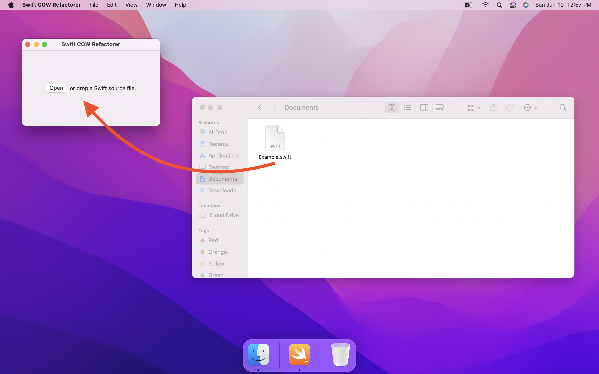
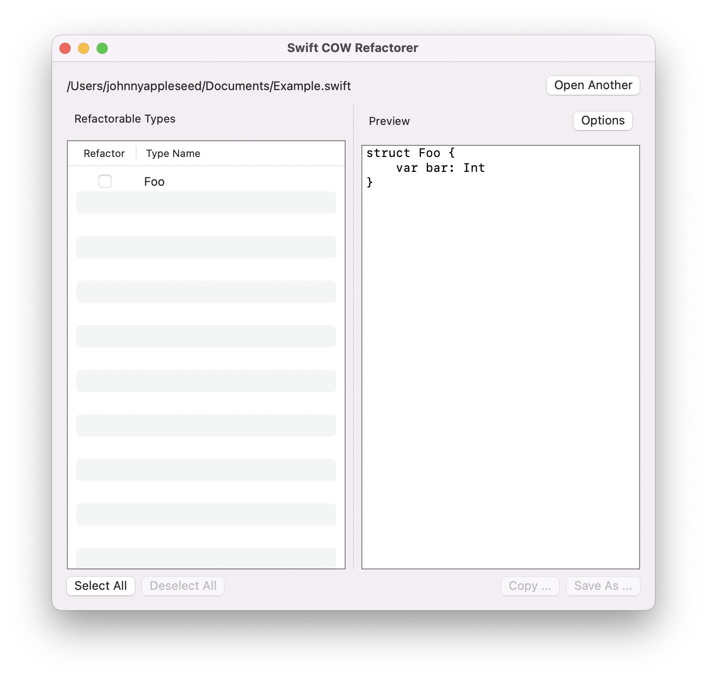
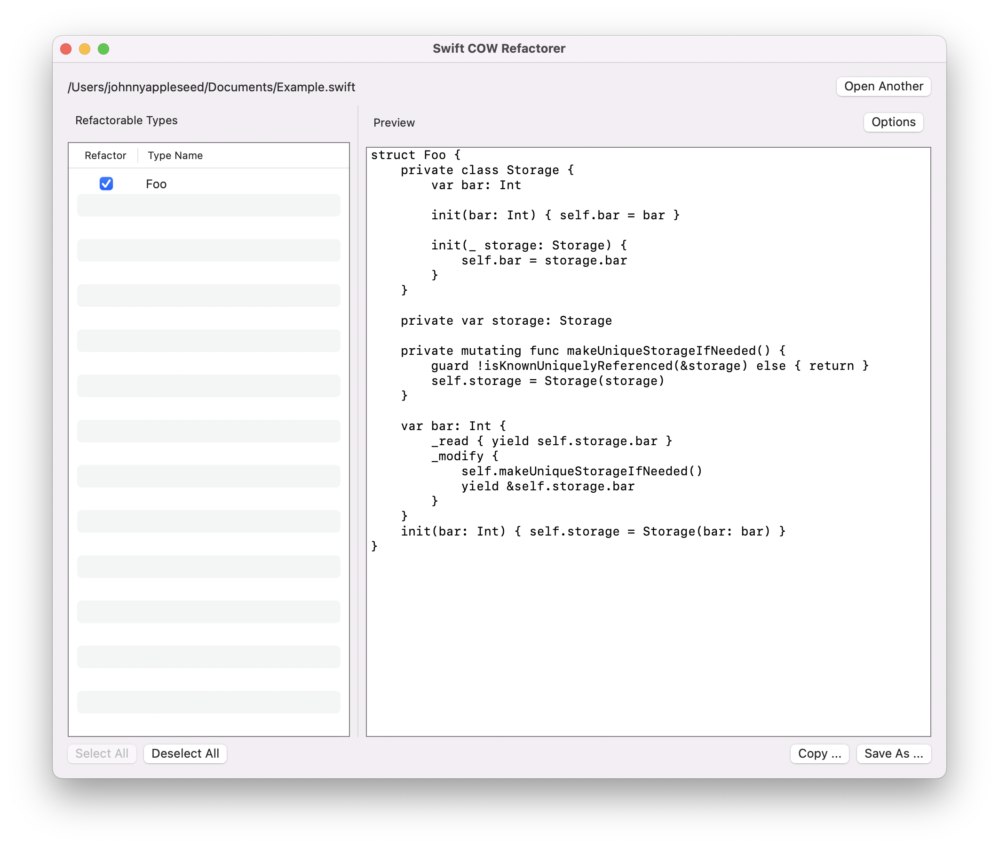
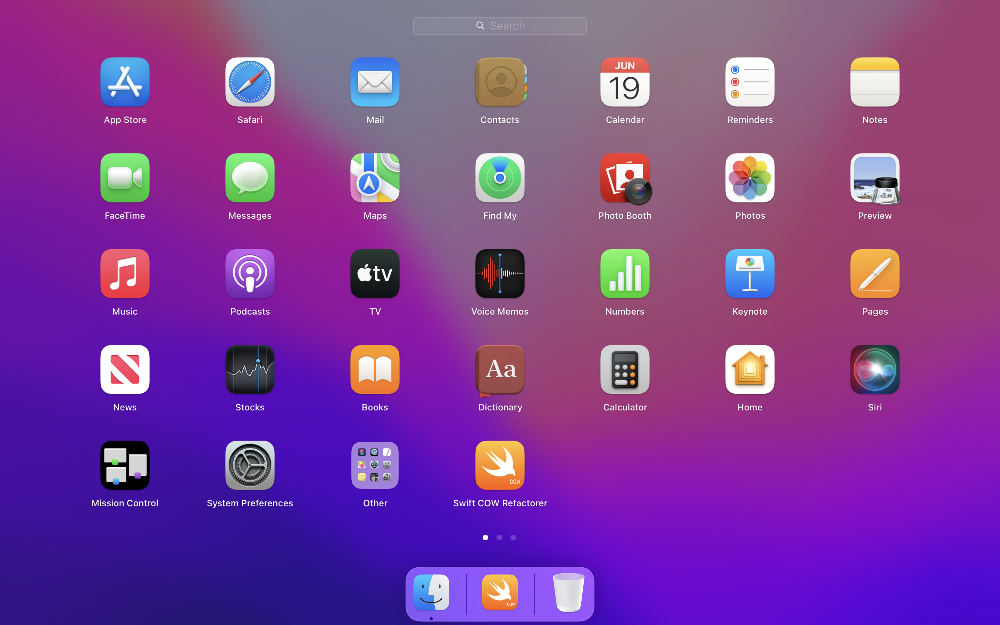

# Swift Copy-on-Write Refactorer

Swift Copy-on-Write Refactorer is a file-level refactorer to refactor a
normal Swift `struct` with **copy-on-write** semantics. This app is
written in SwiftUI and powered by SwiftSyntax and SwiftFormat. 

You can simply drag a Swift source file and drop to the app and then
refactor all available `struct` types in this file.

> Since this program works with a single Swift source file which means
> type info may be incomplete, this refactorer does not implement type
> inferrence. This means that you need to hand input the type for
> no type annotated `struct` property like `var foo = 0`.

## Screenshots

## License
MIT

